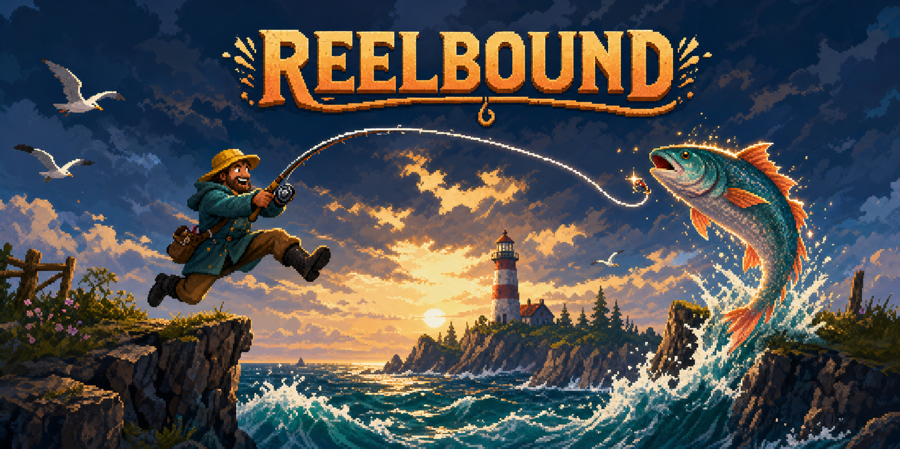

# Reelbound

**Reelbound** is a movement-first pixel platformer about a fisherman chasing legendary catches. Wall jump, wavedash, air-dash, stomp hostile crabs, and use your fishing line as a momentum-driven grappling hook.

## Play

Play the latest build at [chanman64.github.io/reelbound](https://chanman64.github.io/reelbound/), or run any local web server in the repository.

| Action | Keyboard |
| --- | --- |
| Move / aim | WASD or arrow keys |
| Jump / release line | Space or Z |
| Cast / retract | E or X |
| Eight-direction dash | Shift or C |
| Restart at checkpoint | R |
| Pause | Escape |

### Movement tech

- **Variable jump:** Hold jump for height or release early for a short hop.
- **Wall jump:** Hold toward a wall to slide, then jump to kick away.
- **Wavedash:** While airborne, hold down plus left or right and dash diagonally into the ground. Jump during the teal speed window to carry momentum.
- **Grapple release:** Cast near a gold hook, build a swing, then jump to release while preserving speed.
- **Dash refresh:** Landing, bouncing, and stomping an enemy restore the air dash.

## Full-length demo voyages

1. **Sunset Shipyard** - wall movement, wavedashes, moving cranes, and a winch puzzle.
2. **Glowkelp Grotto** - grappling, bubble currents, moving platforms, and route choices.
3. **Stormglass Summit** - diagonal dashes, wall chains, alternating wind, and full-system mastery.

Each voyage is divided by checkpoints and supports a safe main route plus faster technical lines. Time, pearls, falls, score, rank, best times, and catches are saved locally.

## Technology

Reelbound uses dependency-free JavaScript and HTML5 Canvas at a fixed 960x540 internal resolution. The interface includes safe-area-aware landscape touch controls for future iPhone and iPad packaging. Gameplay art is currently procedural while the approved production sprites are developed.

## Roadmap

- Production character and environment sprite atlases
- Gamepad support and remappable controls
- Original chiptune soundtrack
- Story encounters, bosses, and rod upgrades
- Native iOS packaging and TestFlight builds

## License

Copyright (c) 2026. All rights reserved. Source is shared for portfolio and evaluation purposes.
